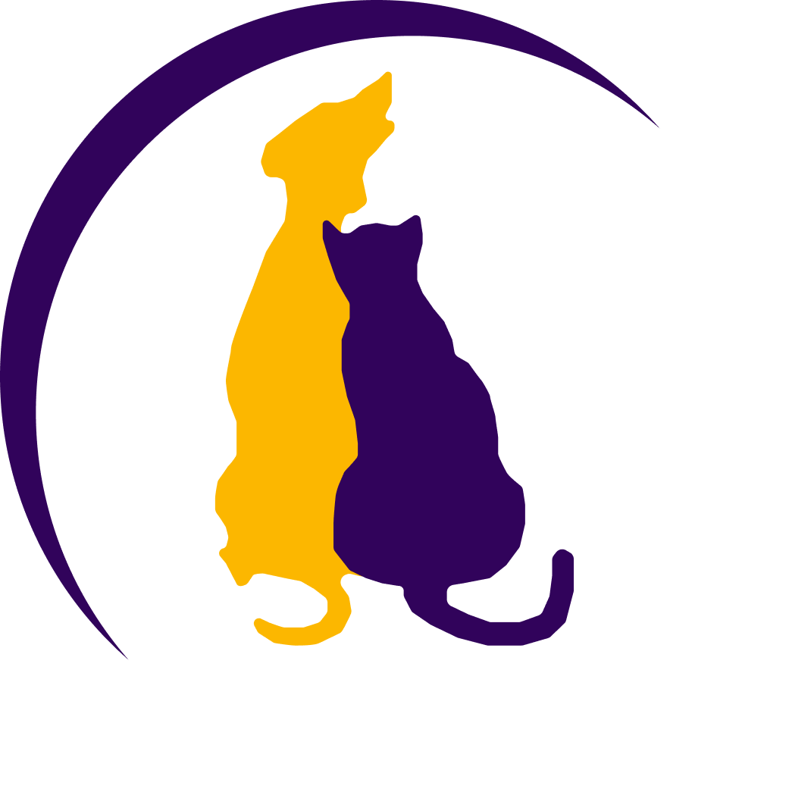

 
    
    <h1> Projeto CentralPet </h1>

 

Desenvolvido a partir do programa de capacitação full-stack ofertado pelo Serviço Nacional de Aprendizagem Comercial (SENAC), o Projeto CentralPet se propõe a abordar uma problemática recorrente na nossa sociedade em relação a adoção de animais: O abandono de animais nas ruas e principalmente o abandono de animais que já foram adotados 
 
 
Visando resolver este problema foi criado o CentralPet. Com ele você pode pesquisar pelos pets que podem ser adotados de forma responsável. Além disso, você tem acesso ao perfil do pet e consegue analisar se ele é adequado a sua vida, bem como avaliar todo o processo de adoção com a ONG. Desta forma, utilizando o CentralPet, o tutor irá realizar uma adoção responsável e o pet será acompanhado até o final da sua vida, reduzindo a taxa de abandono.
 
---

## Empresarial:

### 🎯 Missão

Ser um sistema intermediador entre ONGs e pessoas que querem adotar, fazendo com que o processo seja de forma responsável.

### 👁 Visão

Passar para as pessoas que adotam animais o quão importante é ser feito de uma forma responsável para assegurar que animal tenha uma vida digna.

### 💎 Valores

Incentivo a adoção responsável, ética e assegurando que os animais não voltem para as ruas.

 

---

## 💻 Tecnologias Utilizadas

O sistema CentralPet foi desenvolvido na linguagem de programação Java, dispondo da utilização do Jakarta Servlet, um componente do Java usado para estender as funcionalidades de um servidor. Também foi utilizado a framework Hibernate para o mapeamento objeto-relacional escrito na linguagem Java. Para trabalhar com banco de dados MySQL, utilizamos o Criteria API do Java, que nos permite trabalhar com queries sem manipular diretamente o SQl (Structured Query Language).
  
Para o front-end, utilizamos das tecnologias básicas de HTML, CSS e Javascript, trabalhando também com Jakarta Server Pages (JSP) para criação dinâmica das páginas web.
 

---
## ☕ Desenvolvedores:

> Beatriz Helena Zeferino - [Linkedin](https://www.linkedin.com/in/beatriz-zeferino-72437b201/)
>
> Emanoel Lucas Sousa Lima - [Linkedin](https://www.linkedin.com/in/emanoel-lucas-b12591205/)
>
> Erik Uller - [Linkedin](https://www.linkedin.com/in/erik-uller-4a5329260/)
>
> Henrique Lary Schmidt - [Linkedin](https://www.linkedin.com/in/henrique-lary-schmidt-9a0ab1280/)
> 
> Juan Fernandes Alves - [Linkedin](https://www.linkedin.com/in/juan-fernandes-alves-460717244)
> 
> Lorenço Zambiazi de Oliveira - [Linkedin](https://www.linkedin.com/in/lorenco-zambiazi-de-oliveira-234308200/)
> 
> Uesley Kaue Foro de Sousa - [Linkedin](https://www.linkedin.com/in/kauê-foro-0a254b221)
